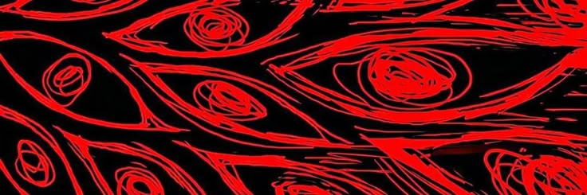

<div align="center">



<br>

# N0Hfacee

`Fullstack Developer` • `Linux Enthusiast` • `Human`

> *Don't like me. Just follow my works.*

<br>

</div>

---

## Identity

```txt
Name        :: N0Hfacee
Role        :: Fullstack Developer
Focus       :: Open Source
Condition   :: Relentless
```

---

## Who Am I

I build software that deserves to exist.

Learning never belongs to one person.

From community. To community.

> **Jesus is King.**

---

## Current Stack

<table>

<tr>

<td align="center">


</td>

</tr>

<tr>

<td align="center">


</td>

</tr>

<tr>

<td align="center">


</td>

</tr>

</table>

---

## Currently Learning

```txt
Rust

Django
```

---

## Featured Work

### Python Terminal User Interface

> Started as a simple experiment.

> Turned into a project maintained for more than two years.

Still improving.

Still learning.

---

## Interests

```txt
Monster Hunter

Creative Sandbox

Math Rock

Looking for Zinogre Tail...
```

---

## Philosophy

```txt
Living Buddha.

Make something useful.

Open source isn't about free software.

It's about shared knowledge.
```

---

## Statistics

<div align="center">


</div>

<br>

<div align="center">


</div>

---

## Mission

```
Build useful software.

Not useful repositories.
```

---

<div align="center">

`Transmission End`

━━━━━━━━━━━━━━━━━━━━━━━━━━━━━━━━━━━━━━

N0Hfacee • 2026

</div>
